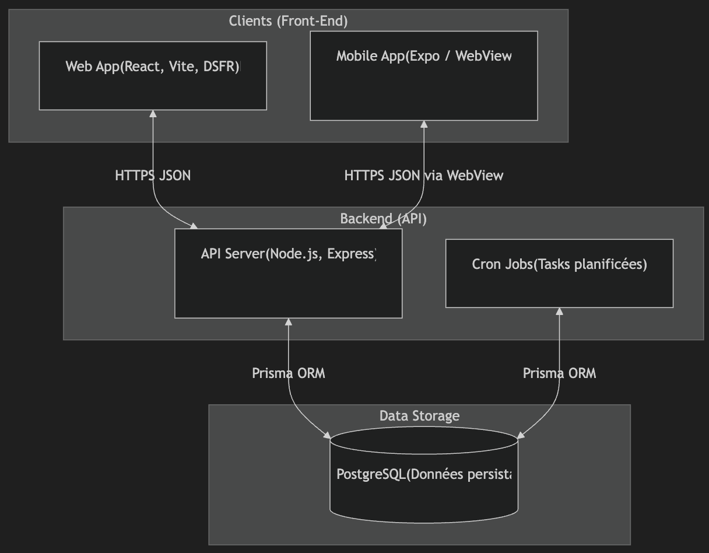
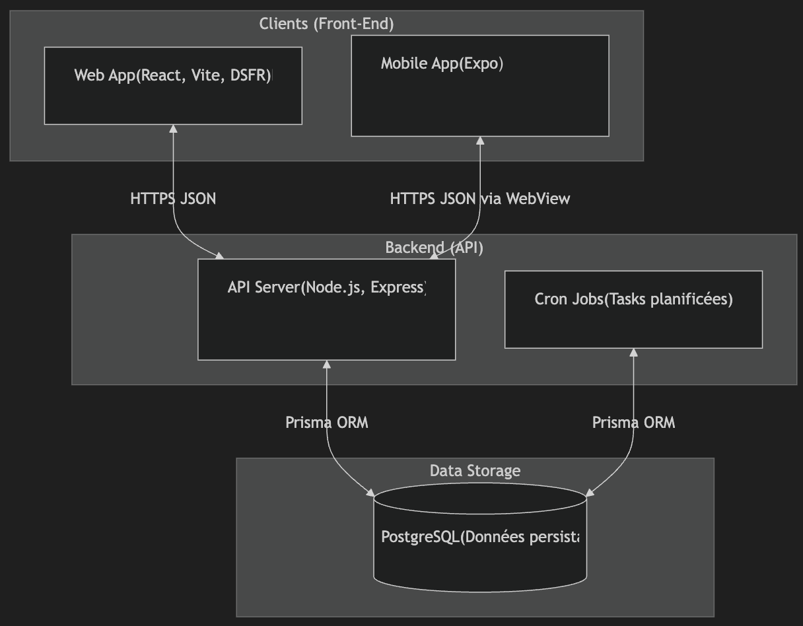

# Documentation du Projet Zacharie

Ce document présente l'architecture actuelle et visée, les données collectées et exposées, ainsi que le cadre technologique du projet.

## 1. Schémas d'Architecture

### Architecture Actuelle ("Zacharie V1 / Transition")

L'application repose sur un backend Node.js classique. L'application mobile n'est pas une application native mais un **encapsuleur (WebView)** affichant l'application Web.

### Architecture Envisagée ("Zacharie V2 / Cible")

L'objectif est de consolider l'approche "Local-First" et de développer une véritable application mobile native. Le backend continue d'évoluer vers un rôle de "Relai de Synchronisation" et de consolidation. L'application mobile devient une app native React Native (Expo) avec une UX optimisée pour le terrain et les conditions de chasse.

_Note : Ce schéma est une projection technique susceptible d'évoluer._

---

## 2. Données Actuellement Collectées

Les données ci-dessous sont stockées en base de données (PostgreSQL).

**Utilisateurs (`User`)**

- **Identité** : Nom, Prénom, Email, Téléphone, Numéro CFEI (Chasseur Formé).
- **Adresses** : Adresse postale complète.
- **Rôles & Permissions** : Rôles (Admin, Chasseur, Collecteur, ETG, SVI, etc.), Permissions spécifiques.
- **Préférences** : Canaux de notification (Email, SMS, Push).
- **Technique** : Identifiants de connexion, Tokens Push, Dates de connexion/activité.

**Entités (`Entity`)**

- **Identité** : Raison sociale, Nom d'usage, SIRET, Numéro DDECPP.
- **Localisation** : Adresse postale du siège/établissement.
- **Responsable** : Nom/Prénom du responsable.
- **Configuration** : Type d'entité (Premier Détenteur, SVI, ETG, etc.), Certification.

**Fiches d'Examen Initial (`Fei`)**

- **Méta-données** : Numéro unique, Date/Heure/Lieu de mise à mort.
- **Acteurs** : Examinateur Initial, Premier Détenteur, Acheteur/Intermédiaire, SVI.
- **Workflow** : Statuts (Approuvé, Rejeté, Clos), Dates de validation par étape.
- **Traçabilité** : Chaîne de détention (Transfert entre acteurs).

**Carcasses & Venaison (`Carcasse`)**

- **Identification** : Numéro de bracelet, Espèce (Cerf, Sanglier...), Poids.
- **Sanitaire** : Résultats d'examen (Anomalies carcasse/action), Décisions vétérinaires (Saisie, Consigne, Levée).
- **Traçabilité** : Certificats associés (Saisie, Consigne).

**Logistique & Technique**

- **Logs d'Audit** : Historique des actions sensibles (Modification de FEI, Connexion).
- **Clés API** : Gestion des accès tiers.

---

## 3. Données Exposées à l'API

Il convient de distinguer l'API utilisée par l'application Zacharie (Web/Mobile) et l'API Publique ouverte aux partenaires.

### A. API App (Interne / Sync)

Cette API est consommée exclusivement par l'application Zacharie (via authentification utilisateur).

| Catégorie                | Données Exposées                                       | Remarques                                        |
| :----------------------- | :----------------------------------------------------- | :----------------------------------------------- |
| **Profil Utilisateur**   | Intégralité du profil connecté (Nom, Prénom, Rôles...) | Mot de passe hashé exclu.                        |
| **Entités**              | Données complètes des entités liées à l'utilisateur    | Pour la gestion et l'affichage dans l'app.       |
| **Examen Initial (FEI)** | Lecture et Écriture complète                           | Création, modification, validation des fiches.   |
| **Carcasses**            | Lecture et Écriture complète                           | Saisie des données sanitaires et de traçabilité. |
| **Référentiels**         | Listes complètes (Espèces, Anomalies...)               | Nécessaire au fonctionnement de l'app.           |

### B. API Publique V1 (Accès Tiers)

Cette API est destinée aux partenaires et logiciels tiers, sécurisée par **Clé API**. Elle offre un accès restreint en lecture seule pour la traçabilité.

| Endpoint (Scope)              | Données Exposées                                                                   | Remarques                                                                  |
| :---------------------------- | :--------------------------------------------------------------------------------- | :------------------------------------------------------------------------- |
| **FEI** (`/fei`)              | **Lecture Seule**. Données filtrées de la fiche (Dates, Numéro)                    | Accès limité aux fiches concernant le partenaire (via le scope de la clé). |
| **Carcasse** (`/carcasse`)    | **Lecture Seule**. Données sanitaires et de traçabilité (Poids, Statut, Décisions) | Permet de récupérer le statut sanitaire d'une carcasse spécifique.         |
| **Approbation** (`/approval`) | **Écriture**. Demande de liaison Clé API <-> Utilisateur                           | Permet à un tiers de demander l'accès aux données d'un utilisateur.        |

_Note : L'API Publique n'expose JAMAIS de données personnelles sensibles (téléphone, emails tiers) ni de données techniques internes._

---

## 4. Framework de Développement

L'application repose sur une stack moderne **TypeScript** de bout en bout :

- **Backend** : **Node.js** avec **Express** pour l'API et **Prisma** comme ORM (interface base de données PostgreSQL).
- **Frontend Web** : **React** propulsé par **Vite**, utilisant **React Router** pour la navigation et le système de design de l'État (**React-DSFR**).
- **Mobile** : **Expo (React Native)** utilisé comme encapsuleur (**WebView**) de l'application Web, permettant une distribution sur les Stores (iOS/Android) sans maintenir de code natif spécifique.
- **Architecture** : Approche **Local-First** permettant une utilisation hors-ligne robuste grâce à une synchronisation asynchrone des données.
